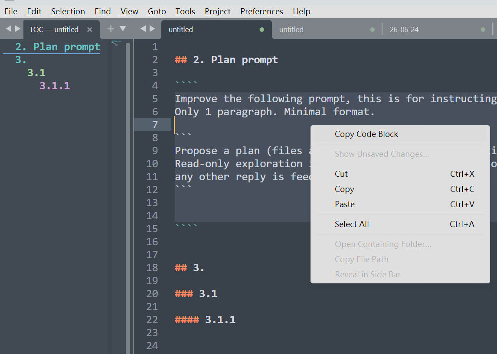

# Markdown TOC

Markdown outline extensions for Sublime Text 4 and Visual Studio Code.



## Editor support

| Editor | Source | Support |
| --- | --- | --- |
| Sublime Text 4 | [`st4/`](st4/) | Docked TOC pane, live refresh, navigation, copy code block, cut section |
| VS Code | [`vscode/`](vscode/) | Activity-bar outline, live refresh, navigation, copy code block, cut section |
| vscode.dev | [`vscode/`](vscode/) | Supported by the same browser-compatible VS Code bundle |

Both implementations understand ATX and Setext headings, ignore headings in
fenced code blocks, and remove common inline Markdown from outline labels.

## Install Sublime Text 4

Download the `MarkdownTOC-st4-*.zip` file from a release and extract the
contained `MarkdownTOC` directory into Sublime Text's `Packages` directory.
You can open that directory with **Preferences > Browse Packages**.

For development, clone this repository and link `st4/` into `Packages` under
the exact name `MarkdownTOC`:

```sh
# macOS
ln -s "$PWD/st4" "$HOME/Library/Application Support/Sublime Text/Packages/MarkdownTOC"

# Linux
ln -s "$PWD/st4" "$HOME/.config/sublime-text/Packages/MarkdownTOC"
```

```powershell
# Windows (run in an elevated shell or with Developer Mode enabled)
New-Item -ItemType SymbolicLink `
  -Path "$env:APPDATA\Sublime Text\Packages\MarkdownTOC" `
  -Target "$PWD\st4"
```

Use `Ctrl+Alt+T` to show or hide the pane. See [`st4/README.md`](st4/README.md)
for all commands and settings.

## Install VS Code

Download the `.vsix` file from a release and run **Extensions: Install from
VSIX...** in desktop VS Code. The extension contains a browser entry point and
can also be published to the Visual Studio Marketplace for use on
[vscode.dev](https://vscode.dev/).

Use `Ctrl+Alt+T` (`Cmd+Alt+T` on macOS) to focus the Markdown TOC view. See
[`vscode/README.md`](vscode/README.md) for commands and development steps.

To sideload the web extension on vscode.dev without publishing it to the
Marketplace, run the included `uv`-managed HTTPS server:

```sh
uv run --script vscode/serve_vscode_dev.py --install-mkcert --open
```

## Development

```sh
python -m unittest discover -s st4/tests
python -m py_compile st4/md_toc.py

cd vscode
npm ci
npm run check
```

CI runs both suites. Tags matching `v*` create a GitHub release containing a
ready-to-extract Sublime Text zip and a VS Code VSIX.

## License

MIT
